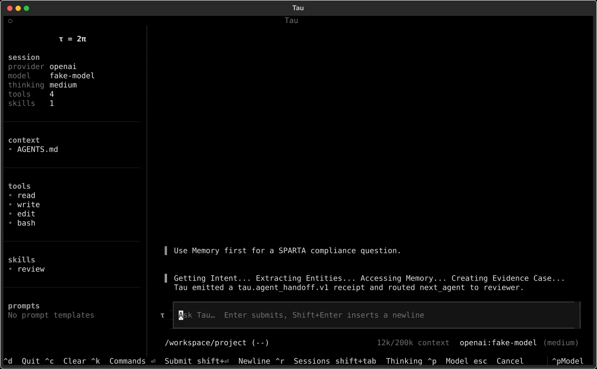
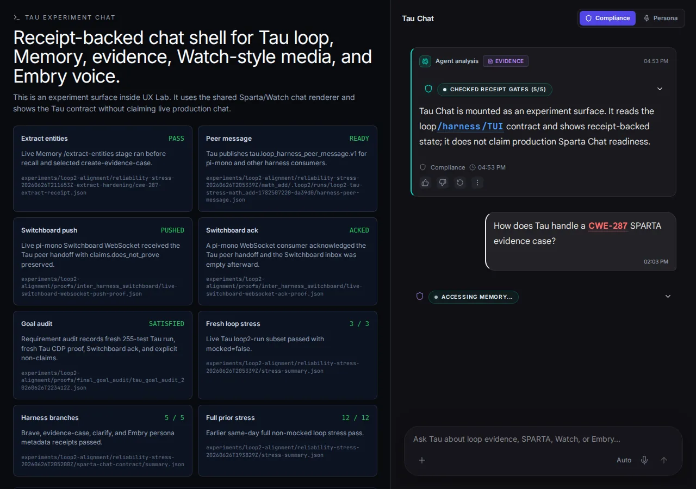

# Tau

<p align="center">
  
</p>

> Agents hallucinate. Tau contains them.

Tau is the agentic harness for Embry-OS and Sparta Explorer.

Embry-OS provides the local or air-gapped operating environment: memory, scillm,
local model providers, APIs, monitors, evidence services, and operator
infrastructure.

Sparta Explorer provides the human evidence workbench: posture, QRA state,
evidence cases, blockers, monitor health, proof chains, and signoff readiness.

Tau provides the zero-trust control plane: policy/data-boundary gates, DAG
contracts, typed receipts, evidence validators, bounded subagent dispatch,
local provider checks, and human approval gates.

The idea is simple:

```text
agents may propose
T’au decides what counts
humans own goals and high-risk approvals
```

Tau is an experimental, memory-first, zero-trust containment harness for
untrusted agent work. It treats every agent output as a claim, not a fact.
Before high-stakes work can continue, Tau expects explicit policy, data-boundary
checks, DAG contracts, receipts, evidence artifacts, validators, and human-gated
side effects.

Tau does not hide orchestration inside model reasoning. Every handoff produces
a local receipt, a schema-valid JSON block, a Herdr-visible work surface, or a
GitHub-shaped projection that another agent or human can inspect, replay, or
reject.

External-review materials for the synthetic Embry-OS / Sparta Explorer airgap
demo start here:

- [Tau Non-Claims](docs/non-claims.md)
- [Demo Data Policy](docs/demo-data-policy.md)
- [GitHub Review Access](docs/github-review-access.md)
- [Tau for Air-Gapped Agentic Compliance](docs/briefs/tau-for-airgapped-agentic-compliance.md)
- [External Review Backlog](docs/external-review-backlog.md)

## Why Tau exists

Raw agent DAGs and swarms are not trustworthy. More agents can mean more
hallucination, false consensus, responsibility diffusion, and side-effect risk.

Tau does not make agents trustworthy. It makes agent work bounded,
inspectable, rejectable, and policy-gated.

A Tau DAG is not proof. It is a containment map.

A reviewer agent is not a trust anchor. It is another untrusted claim source.

A swarm consensus is not evidence. Evidence must be captured, hashed,
validated, and reviewed.

## What makes Tau different

| Capability | Tau stance |
| --- | --- |
| Memory | Memory is not context stuffing. Memory intent is a dispatch and routing input. |
| Evidence | Evidence is separate from model prose. Typed manifests, receipts, and artifacts are validated independently. |
| Coding work | Code changes count only when patch, diagnostics, tests, review, debug, worker, and commit-plan receipts make the evidence inspectable. |
| Agent DAGs | DAGs are containment maps, not proof. |
| Subagents | Subagent communication is untrusted until receipt-backed and validated. Persistent subagent surfaces must be declared in the DAG and remain bounded by Tau ticks. |
| Herdr | Provider/subagent work can be monitored through visible panes, lifecycle records, and cleanup receipts. |
| DAG visualization | Browser graph views render DAG contracts and receipts for inspection; the artifacts remain authoritative. |
| Policy | Policy profiles and data boundaries are checked before zero-trust DAG dispatch. |
| Side effects | GitHub, Memory, Herdr, provider, and filesystem effects require explicit gates. |
| Claims | Every proof artifact should state what it proves and what it does not prove. |

## Current zero-trust stack

Tau's zero-trust stack is built around one rule:

```text
No policy compatibility, no data boundary, no receipt, no evidence, no approval - no action.
```

Implemented local gates and receipt surfaces in this checkout include:

- `tau.policy_profile.v1`
- `tau.data_boundary.v1`
- `tau.zero_trust_preflight_receipt.v1`
- `tau.memory_intent_gate_receipt.v1`
- `tau.evidence_case_gate_receipt.v1`
- `tau.evidence_manifest.v1`
- coding evidence receipts for patches, diagnostics, focused test runs, review
  findings, debug sessions, GitHub reads, OMP/SciLLM workers, and commit plans
- `tau.command_spec_policy.v1`
- `tau.github_apply_policy.v1`
- `tau.github_apply_policy_receipt.v1`
- `tau.herdr_workspace_lease.v1`
- Herdr cleanup and GC receipts
- provider readiness, lifecycle, work-order, and node receipts
- `tau.persistent_subagent.v1` declarations on DAG nodes for persistent local
  subagent surfaces such as Embry voice
- DAG signal and route-memory candidate receipts
- adaptive DAG expansion validation, policy, and apply receipts
- browser/CDP proof receipts
- proof index build receipts
- `tau.dag_error.v1` course-correction payloads

These are containment and review mechanisms. They do not prove ITAR
compliance, legal sufficiency, model safety, future route correctness, or that
an agent DAG is trustworthy.

The policy/data-boundary gate is documented in
[Zero-Trust Policy/Data-Boundary Preflight](docs/zero-trust-policy.md).
The adversarial model is documented in
[Tau Zero-Trust Threat Model](docs/threat-model.md).
The local API hardening path is documented in
[Tau Local API Hardening Roadmap](docs/api-hardening-roadmap.md).

## Coding evidence and code-work admissibility

Tau's zero-trust coding lane treats code work the same way it treats agent
handoffs: a model's claim is not evidence. Coding work becomes admissible only
when it is backed by typed receipts that another agent or human can inspect.

Current coding evidence surfaces include:

- `tau.code_patch_receipt.v1` for hash-bound source edits;
- LSP diagnostic and exact-symbol receipts for local code evidence;
- `tau.test_run_receipt.v1` for focused local pytest-shaped checks;
- `tau.review_findings.v1` for structured reviewer findings;
- `tau.debug_session_receipt.v1` for bounded debugger/DAP evidence;
- GitHub read receipts for read-only issue, pull request, commit, diff, and file
  evidence;
- OMP and SciLLM worker receipts with policy/data-boundary hash binding;
- `tau.commit_plan_receipt.v1` for source/evidence coverage before commit;
- course-correction and orchestration reliability receipts for blocked or
  drifting coding runs.

Compliance packages can collect these coding receipts under
`coding-evidence-receipts/`, package validation rejects malformed or mocked
coding evidence when present, and static run reports render a first-class
`coding-evidence` section with receipt status, hashes, policy/data-boundary
hashes, and explicit proof boundaries.

This proves inspectability and gate behavior for the recorded receipts. It does
not prove semantic code correctness, reviewer truthfulness, provider/model
quality, ITAR compliance, legal sufficiency, or full project completion.

## Herdr-visible subagent monitoring

Tau does not treat provider agents as invisible API calls only. In
provider-live lanes, Tau can allocate visible Herdr workspaces and panes,
record provider readiness, capture pane/process lifecycle evidence, dispatch
work orders, validate node receipts, and clean up run-owned workspaces through
lease/approval gates.

Visible panes are evidence, not truth. Tau still treats pane output as an
untrusted signal until a receipt validates the expected goal, node, attempt,
work-order hash, and evidence artifacts.

## Persistent subagent surfaces

Some subagents should remain visible across bounded Tau DAG ticks. Project
agents declare these as generic persistent subagent surfaces. One concrete
example is the Embry Chatterbox voice surface:

```text
http://localhost:3002/#embry-voice
```

DAG authors can declare this directly on a node with
`persistent_subagent.schema = tau.persistent_subagent.v1`. Tau requires the
surface to be a local route, `session_mode: persistent`,
`tau_control: bounded_receipt_gated_ticks`, and
`unbounded_autonomy_allowed: false`. The node must also require
`persistent_subagent_receipt` evidence.

Tau propagates the declaration into the compiled node command spec and the
start handoff context so the project agent receives the persistent surface as a
DAG parameter. The persistent surface can stay open; Tau still accepts only
bounded, receipt-backed outputs. See
[Persistent Subagent Surfaces](docs/persistent-subagent-surfaces.md) and the
copyable example in
[`examples/embry-voice-persistent-subagent/`](examples/embry-voice-persistent-subagent/).

## Status snapshot

| Area | Status | Boundary |
| --- | --- | --- |
| Policy/data-boundary preflight | Implemented | Gate only; not compliance certification. |
| Typed evidence manifest | Implemented | Validates artifact metadata; does not prove semantic truth. |
| Coding evidence receipts | Implemented for current local coding lane | Makes code-work evidence inspectable; does not prove semantic correctness. |
| Focused test-run receipts | Implemented | Records focused pytest-shaped checks; not full-suite health unless the full suite was run. |
| Compliance package coding evidence | Implemented | Packages and validates receipt metadata; not legal/compliance sufficiency. |
| Static run-report coding evidence | Implemented | Renders receipt metadata; not operational truth beyond artifacts. |
| Command-spec trust policy | Implemented | Local command policy gate; not a sandbox. |
| Herdr-visible provider lanes | Implemented in proof lanes | Visible pane state is evidence, not truth. |
| Herdr cleanup/GC | Implemented with leases/approval gates | Does not prove arbitrary non-Tau cleanup. |
| Persistent subagent DAG surfaces | Implemented as DAG node validation and dispatch metadata | Does not prove the local UI route, audio path, Memory writes, or subagent semantic quality. |
| Canonical DagPlan scheduler | Implemented for project and generic local DAG adapters | One scheduler owns readiness, retries, routes, joins, deadlines, cancellation, and terminal settlement; durable restart and provider/model quality remain unproven. |
| Typed DAG route decisions | Implemented for `bounded-ready-queue` | Closed typed result-field routing with replayable receipts; does not prove source-result truth. |
| Terminal contributions and join policies | Implemented for `bounded-ready-queue` | Per-edge terminal receipts, eight deterministic policies, skip/block propagation, timeout closure, and replayable join decisions; does not prove branch-result truth. |
| GitHub apply policy | Implemented as a local gate | Does not itself post to GitHub. |
| Browser/CDP proof lane | Implemented for proof surfaces | Not a production chat UI proof. |
| Tau DAG React Flow viewer | Implemented as a self-contained Tau surface | Read-only journal projection with packaged assets; does not authorize DAG mutation or prove provider/model semantics. |
| Proof index | Implemented | Indexes receipt metadata and hashes; does not prove receipt semantic truth. |
| Route-memory signals | Implemented as local receipts | No approved Memory sync unless explicitly run. |
| Adaptive DAG expansion | Implemented as validate/policy/apply artifacts | Does not mutate a running DAG silently. |
| Memory/evidence-case gate | Initial DAG pre-dispatch gate implemented | Validates observable Memory intent and separate evidence-case payloads; does not prove Memory truth. |
| `tau run` convenience command | Implemented | Convenience alias for the current DAG execution path. |
| Copyable examples | Initial examples implemented | `zero-trust-basic` and `herdr-visible-provider` cover first runnable lanes only. |

## Positioning

Tau is not trying to be a better general-purpose agent framework. General agent
frameworks focus on making agents easier to build, compose, deploy, and scale.
Tau focuses on making untrusted agent work admissible or rejectable before it
counts.

Tau's differentiated stance is:

- memory intent before dispatch where Memory is available;
- evidence artifacts separate from model prose;
- Herdr-visible subagent monitoring for provider lanes;
- policy and data-boundary gates before zero-trust DAG dispatch;
- receipts and validators instead of agent consensus;
- explicit non-claims for every proof rung.

## Research Influence: Adaptive DAGs

T’au's adaptive DAG direction is inspired by graph reasoning, parallel tool
scheduling, structured multi-agent workflows, and bounded swarm/stigmergy
research. The implementation deliberately translates those ideas into Tau-native
constraints: DAG contracts, receipts, validators, route signals, and human
control of immutable goal changes.

Primary references for critique and follow-up are collected in
[Adaptive DAG Research References](docs/adaptive-dag-research-references.md).
The most relevant papers are:

- [Graph of Thoughts](https://arxiv.org/abs/2308.09687), for graph-structured
  reasoning as an inspiration for explicit DAG work/evidence nodes.
- [Adaptive Graph of Thoughts](https://arxiv.org/abs/2502.05078), for bounded
  dynamic DAG expansion ideas.
- [An LLM Compiler for Parallel Function Calling](https://arxiv.org/abs/2312.04511),
  for ready-node scheduling with dependency-aware parallel execution.
- [MetaGPT](https://arxiv.org/abs/2308.00352), for role workflows and
  intermediate verification.
- [SwarmSys](https://arxiv.org/abs/2510.10047) and
  [AMRO-S](https://arxiv.org/abs/2603.12933), for receipt-derived route signals
  and quality-gated routing-memory inspiration.
- [The Bystander Effect in Multi-Agent Reasoning](https://arxiv.org/abs/2605.10698),
  as a caution against unstructured agent swarms and consensus-as-proof.

These papers are references, not closure evidence. Tau's claims still come from
local tests, live/non-mocked receipts, committed artifacts, and explicit
`proof_scope` boundaries.

## What it does

T’au provides two layers plus one opt-in orchestration mode:

1. **Coding-agent runtime** - an installable `tau` command with provider
   configuration, a Textual TUI, session history, slash commands, local tools,
   and print-mode execution.
2. **Agentic harness** - goal-locked receipt contracts, bounded
   subagent dispatch, Memory-first chat routing, and dry-run GitHub ticket/comment
   projections.
3. **Special orchestrated subagent mode** - activated only when a
   `tau.agent_handoff.v1` start packet is passed through `--start` or
   `TAU_ORCHESTRATOR_START`. This mode treats Tau as a ticket/receipt router:
   one handoff in, one bounded subagent command, one receipt out, then stop or
   wait for the next cron/GitHub tick.

The coding runtime stays small and teachable. The harness adds the control plane
needed for longer work. The special mode is deliberately separate from ordinary
chat and CLI use so a normal Tau turn cannot silently become an autonomous
agent loop.

- `tau.agent_handoff.v1` JSON for routing between subagents and humans
- `tau.generated_ticket.v1` JSON for ChatGPT Pro / WebGPT ticket drafts
- `tau.human_goal_change.v1` packets that only a human can send
- deterministic goal-guardian reconciliation receipts
- command-backed subagent loops with finite steps
- GitHub transport that is dry-run by default and apply-gated
- Memory-first route handling for chat surfaces
- a T’au-owned UX contract that UX Lab can host as an integration viewer
- proof artifacts that state what was exercised and what remains unproven

## Loop, harness, TUI, and chat

T’au has four related surfaces. They should not be collapsed into one vague
"agent" concept.

| Surface | Owned here? | Purpose |
| --- | --- | --- |
| **Loop** | Yes | Runs one bounded agent turn or command-backed route, records what happened, and stops at a declared condition. |
| **Harness** | Yes | Validates receipts, goal hashes, handoff JSON, command specs, GitHub projections, and subagent routing before the loop can advance. |
| **TUI** | Yes | Terminal frontend for the coding-agent runtime. It is one renderer of the agent loop, not the whole harness. |
| **Chat** | Contract owned here; browser viewer in UX Lab | Memory-first shared chat surface that renders stages, receipts, handoffs, and proof boundaries for human inspection. |
| **DAG viewer** | Yes | Packaged, read-only React Flow projection of the immutable source DAG, compiled `DagPlan`, authoritative scheduler journal, runtime diagnostics, and admitted receipts. |

The loop is intentionally bounded. A subagent does one step, emits a
schema-valid handoff, names the next agent, and exits. The harness decides
whether that handoff is valid enough to continue. Long-running behavior comes
from an orchestrator repeatedly invoking bounded steps, not from an unbounded
model while-loop.

T’au has a special parameter-driven orchestration mode. Normal chat or CLI use
does one local turn. When a `tau.agent_handoff.v1` start handoff is supplied via
`--start` or `TAU_ORCHESTRATOR_START`, T’au enters the orchestrated subagent loop:
validate the handoff, select `next_agent.name`, run one bounded command spec,
validate the emitted handoff, write receipts, and stop at `human` or a
fail-closed condition. Cron or GitHub ticket polling can repeat those bounded
ticks, but no subagent owns an unbounded while-loop.

For cases that need repeated bounded ticks under one deadline, Tau also exposes
a goal-run controller:

```bash
uv run tau goal run \
  --until-complete \
  --start start-handoff.json \
  --goal-helper goal-helper.json \
  --active-goal-hash sha256:... \
  --receipt-dir /tmp/tau-goal-run \
  --agents-root agents \
  --command-spec-root command-specs \
  --timeout-s 1800 \
  --tick-max-steps 1
```

`tau goal run` writes `tau.goal_run_receipt.v1`. It repeatedly invokes bounded
handoff command-loop ticks until the latest handoff routes to `human` with a
PASS/COMPLETE result, evidence, and any explicit `goal-helper` completion
criteria listed in `result.completed_criteria`. If the wall-clock deadline
expires first, the receipt is `TIMEOUT`; dispatched command timeouts are capped
by the remaining goal-run deadline. This is a deterministic completion gate,
not a claim that Tau can infer true semantic task success from prose.

The current loop/harness direction is:

```text
human goal
  -> Memory intent / route selection
  -> T’au handoff JSON
  -> receipt expectation
  -> bounded subagent command or external receipt intake
  -> dry-run GitHub projection
  -> next agent or human stop
```

The TUI remains the local coding interface. The chat is the Watch-style human
inspection surface for the harness: it shows Memory stages, route products,
handoff JSON, dry-run GitHub projection, and explicit non-claims.

## Interface snapshots

The checked-in screenshots below show the two current human-facing surfaces.
They are evidence of rendering surfaces, not proof of final Sparta Chat
readiness or live GitHub mutation.

### Textual TUI

<p align="center">
  
</p>

The TUI is the terminal renderer for local agent work. Original upstream Tau
could render transcript, tool, status, and session state. This fork is extending
that surface so harness events can expose Memory pipeline stages such as
`Getting Intent...`, `Extracting Entities...`, `Accessing Memory...`, and
`Creating Evidence Case...` without relying on hidden model reasoning.

### React chat integration viewer

<p align="center">
  
</p>

The React chat surface is hosted by UX Lab as an integration viewer for the
T’au-owned contract in `ui/tau-chat-contract.json`. It borrows the Watch/Sparta
Chat interaction model: content-rich messages, dynamic process status, route
products, evidence blocks, and embedded artifact affordances. T’au owns the
contract and receipts; UX Lab proves that the contract can be rendered in a
browser.

### Self-contained live DAG viewer

Tau packages its own read-only React Flow application:

```bash
uv run tau dag-view --run-dir /path/to/run
```

The viewer binds only to loopback, opens the scheduler SQLite database in
query-only mode, and replaces browser state with Tau-authored journal replay
snapshots. It shows the immutable source DAG, compiled `DagPlan`, scheduler and
admission state, runtime liveness, bounded transaction attempts, route/join
decisions, receipts, and the event timeline. Runtime pane text and reviewer
`PASS` claims remain diagnostic; only a committed scheduler transition can turn
a node green or release a dependent node.

No Node installation is required at runtime because the built application is
included in the Tau wheel. The viewer has no dispatch, retry, approval,
cancellation, cleanup, or editing controls. It does not prove provider/model
semantic quality or make runtime observations authoritative.

## What changed from upstream Tau

This fork keeps the original Python teaching architecture, but adds a goal-locked
agentic harness on top.

Added or materially changed areas include:

- **Loop2 alignment receipts** for bounded loop runs and monitor artifacts.
- **Minimal model-facing JSON contracts** for generated tickets, subagent
  receipts, agent handoffs, and human-only goal changes.
- **Human goal-change bridge** that converts trusted human goal-change packets
  into normal `goal-guardian` start handoffs without letting non-human agents
  mutate the immutable goal.
- **Goal-guardian reconciliation** that classifies open tickets as keep, close,
  migrate, or regenerate before work continues after a goal change.
- **Command-backed subagent dispatch** through opt-in `tau-dispatch-command.json`
  specs, including T’au-owned command-spec overlays for experiments.
- **Command-loop GitHub transport** that renders issue/comment/label commands
  by default and requires explicit `--apply` plus preflight checks for live
  mutation.
- **Read-only GitHub ticket-source fetch** for goal-guardian reconciliation.
- **Memory-first chat contract** for CLARIFY, DEFLECT, ANSWER, RESEARCH, and
  COMPLIANCE routes.
- **External subagent receipt intake** that accepts a supplied
  `tau.agent_handoff.v1` receipt only after validating goal, target, evidence,
  and next-agent continuity.
- **Dry-run external subagent GitHub projection** that turns an accepted external
  receipt into deterministic comment and label commands without claiming
  execution or mutation.
- **T’au-owned UX contract** at `ui/tau-chat-contract.json`, with UX Lab acting
  as an integration viewer rather than the source of truth.
- **Tau-owned live DAG inspection** through `tau dag-view`, where the immutable
  source DAG, compiled plan, scheduler journal, and admitted receipts remain the
  authoritative artifacts.

## When to reach for it

Use T’au when an agent task needs durable state and explicit routing instead of a
single chat response.

| Situation | Why T’au helps |
| --- | --- |
| Long-running implementation work | Each bounded step emits a receipt and names the next agent. |
| Human course correction | Human goal changes are explicit packets routed through `goal-guardian`. |
| ChatGPT Pro / WebGPT collaboration | WebGPT can draft tickets; T’au validates and projects them. |
| GitHub-backed task queues | T’au derives labels such as `next:<agent>` and `executor:<executor>`. |
| Memory-first chat | User turns enter through Memory intent before routing to answer, clarify, deflect, research, or compliance paths. |
| Reliability hardening | Local tests, live browser runs, and proof summaries are kept separate from mocked wiring tests. |

T’au is still experimental. Treat dry-run GitHub transport, local command-loop
receipts, and UX Lab chat evidence as proof of specific rungs, not proof of a
finished global Sparta Chat or production orchestration system.

## Quickstart: zero-trust local run

Install the project environment:

```bash
cd /home/graham/workspace/experiments/tau
uv sync
uv run tau --help
```

Create a local coding zero-trust starter when the project should require
hash-bound patch, diagnostics, review, commit-plan, and course-correction
receipts before coding work counts:

```bash
uv run tau init --profile coding-zero-trust --out /tmp/tau-coding-starter
python -m json.tool /tmp/tau-coding-starter/.tau/dag-template.json
```

Inspect the starter policy and data-boundary fixtures:

```bash
python -m json.tool experiments/goal-locked-subagents/fixtures/zero-trust-policy.json
python -m json.tool experiments/goal-locked-subagents/fixtures/itar-data-boundary.json
```

Run the zero-trust preflight doctor:

```bash
uv run tau zero-trust-doctor \
  --policy-profile experiments/goal-locked-subagents/fixtures/zero-trust-policy.json \
  --data-boundary experiments/goal-locked-subagents/fixtures/itar-data-boundary.json
```

Run a bounded DAG through the product command:

```bash
uv run tau run <dag-spec.json>
uv run tau run-status <run-dir>
uv run tau dag-viewer-link <run-dir>
uv run tau dag-view --run-dir <run-dir>
```

For durable project or generic DAG runs, `run-status` includes a read-only
`dag_viewer` launch contract only when the authoritative `dag-run.sqlite3`
journal replays successfully. Project DAG contracts and receipts remain
supplemental metadata; they are not a substitute for the scheduler journal.
`dag-viewer-link` returns the Tau-owned `tau dag-view` command rather than an
external UX Lab URL. The launch contract does not prove the server is running,
browser rendering, provider semantic quality, GitHub mutation, or future route
correctness.

Build a local proof index when you need a machine-readable ledger over receipt
artifacts:

```bash
uv run tau proof-index build experiments/goal-locked-subagents/proofs/real-world-sanity \
  --out experiments/goal-locked-subagents/proofs/index.jsonl
```

Use `uv run tau dag-run <dag-spec.json>` when you want the explicit
implementation command.

Conditional project DAGs use source-node route modes and closed
`tau.route_condition.v1` edge objects. See
[Typed DAG Routing](docs/typed-dag-routing.md).

For a quick non-mutating regression surface, run:

```bash
scripts/run-real-world-sanity.py --levels simple --receipt-timeout-seconds 120
```

The generic coding-agent runtime still exists, but Tau's primary product
surface is zero-trust containment, not autonomous chat.

Render dry-run GitHub transport from a command-loop receipt:

```bash
uv run tau handoff-command-loop-github-transport \
  /path/to/command-loop-receipt.json \
  --receipt /tmp/tau-github-transport.json
```

By default, GitHub transport renders commands only. Live mutation requires
`--apply` and still runs auth/target preflight checks before comment or label
commands.

## Docker stack

T’au can be built and run from the repo with Docker Compose:

```bash
docker compose --profile cli run --rm tau --help
```

The stack intentionally separates Tau-owned containers from external project
services:

| Service | Purpose |
| --- | --- |
| `tau` | One-shot CLI/TUI/harness container for local commands and smoke checks. |
| `tau-cron` | Long-running scheduler that invokes one bounded `handoff-command-loop` tick per interval. |
| external `embry-memory` | Memory daemon expected at `MEMORY_DAEMON_URL`, usually `http://host.docker.internal:8601`. |
| external `scillm` | Default LLM engine boundary, expected at `SCILLM_BASE_URL`, usually `http://host.docker.internal:4001`. Tau keeps provider-neutral core interfaces and sends provider work through SciLLM adapters. |
| external `ux-lab` | Browser integration viewer, usually `http://host.docker.internal:3002/#tau`. |

Tau treats SciLLM surfaces as distinct contracts: one-shot model names use
`/v1/chat/completions`, while Chutes model pools are reserved for batch
endpoints. Tau must not pass a batch pool name to chat completions or bypass
SciLLM with direct provider API calls.

Start the cron-style orchestrator only after mounting a start handoff:

```bash
TAU_ORCHESTRATOR_START=/workspace/.loop2/start-handoff.json \
TAU_ACTIVE_GOAL_HASH='sha256:...' \
docker compose --profile orchestrator up tau-cron
```

For a deterministic one-tick smoke, set `TAU_ORCHESTRATOR_ONCE=1`:

```bash
TAU_ORCHESTRATOR_START=/workspace/.loop2/start-handoff.json \
TAU_ORCHESTRATOR_ONCE=1 \
docker compose --profile orchestrator run --rm tau-cron
```

The committed Docker smoke fixture exercises that same special mode without
launching the scheduler forever:

```bash
rm -rf .tmp/docker-cron-smoke && mkdir -p .tmp/docker-cron-smoke/receipts

TAU_ORCHESTRATOR_START=/workspace/experiments/goal-locked-subagents/fixtures/docker-cron-start-handoff.json \
TAU_ACTIVE_GOAL_HASH=sha256:active-goal \
TAU_ORCHESTRATOR_ONCE=1 \
TAU_RECEIPT_DIR=/workspace/.tmp/docker-cron-smoke/receipts \
docker compose --profile orchestrator run --rm --build \
  -e TAU_ORCHESTRATOR_START \
  -e TAU_ACTIVE_GOAL_HASH \
  -e TAU_ORCHESTRATOR_ONCE \
  -e TAU_RECEIPT_DIR \
  tau-cron
```

The current local proof artifact is
`.tmp/docker-cron-smoke/receipts/20260628T012315Z/command-loop-receipt.json`.
It records `mocked:false`, `live:true`, `ok:true`, `step_count:1`,
`terminal_agent:"human"`, and `dispatches[0].selected_agent:"reviewer"`.

`tau-cron` does not run an unbounded subagent. It wakes up, invokes one bounded
`handoff-command-loop` tick, writes receipts under `/data/receipts`, sleeps, and
repeats. If the handoff is malformed, the goal hash is stale, a required route
is missing, or an external service is unavailable, the tick fails closed and the
next receipt records the failure.

## Memory-first chat direction

T’au chat begins with the `$memory` pipeline, not with ad hoc product logic.
The intended route is:

```text
intent -> extract entities -> access memory -> answer | clarify | deflect | research | compliance
```

T’au now owns the chat UX contract in this repository:

```text
ui/tau-chat-contract.json
```

UX Lab's `#tau` route is the browser integration viewer, similar to how Watch
has a project-owned operational contract and an external UX Lab surface for
inspection. UX Lab may render and exercise the T’au contract, but it must not be
treated as the canonical owner of the T’au chat contract, harness receipt
schemas, or final Sparta Chat readiness claims.

The original Tau interface was deliberately limited: it could display local
agent transcript and tool output, but it did not understand evidence cases,
content embeds, Watch-style media messages, Memory route products, or
subagent/GitHub handoff receipts. This fork adds the contracts those richer
surfaces need. The target chat UX is a shared Watch/Sparta-style renderer that
can show:

- Memory pipeline stages and route decisions
- answer, clarify, deflect, research, and compliance products
- evidence-case and `create-figure` artifacts when those skills are selected
- content embeds and media/artifact cards
- persona voice metadata, including Embry voice/persona hooks
- full `tau.agent_handoff.v1` JSON and dry-run GitHub projection details

The latest bounded browser slices prove:

- dynamic Memory stage traces can be rendered from receipt data
- CLARIFY, DEFLECT, RESEARCH, COMPLIANCE, and selected ANSWER behavior can fail
  closed when a Memory route product is missing
- successful compliance routes can render a full `tau.agent_handoff.v1` JSON
  contract
- accepted external handoff receipts can project dry-run GitHub comments/labels
  without claiming live GitHub mutation

This is a harness rung, not a final chat product. The final shared chat still
needs accepted UX, real content embed handling, `create-figure`,
`create-evidence-case`, persona voice integration, and live GitHub mutation
policy before it can be treated as production behavior.

## Goal-locked harness model

T’au's agent-facing contract is deliberately small. A normal handoff contains:

```json
{
  "schema": "tau.agent_handoff.v1",
  "github": {
    "repo": "grahama1970/tau",
    "target": "issue#123"
  },
  "goal": {
    "goal_id": "goal-example",
    "goal_version": 1,
    "goal_hash": "sha256:..."
  },
  "previous_subagent": "coder",
  "context": {
    "summary": "What matters now.",
    "artifacts": []
  },
  "result": {
    "status": "COMPLETED",
    "summary": "What changed or was observed.",
    "evidence": []
  },
  "rationale": "Why this result implies the next step.",
  "next_agent": {
    "name": "reviewer",
    "executor": "either",
    "reason": "Independent validation is required."
  },
  "required_evidence": [],
  "stop_condition": "Reviewer posts a schema-valid receipt."
}
```

T’au owns the deterministic expansion:

```text
next_agent.name     -> next:<agent>
next_agent.executor -> executor:<executor>
github.target       -> issue, PR, or new ticket projection
goal_hash           -> active goal validation
schema              -> parser and validator selection
```

Agents do not get to invent missing labels, mutate the immutable goal, or skip
the next route. If the JSON does not validate, T’au refuses to dispatch.

## Special orchestration mode

The default Tau loop is local and bounded: run one prompt, command, or handoff
step, then emit a receipt.

When an orchestration parameter is supplied, Tau enters its special
ticket/receipt mode. The current local form is:

```bash
uv run tau handoff-command-loop \
  --start <tau.agent_handoff.v1.json> \
  --receipt-dir <receipt-dir> \
  --agents-root experiments/goal-locked-subagents/agent-command-specs \
  --command-spec-root experiments/goal-locked-subagents/agent-command-specs \
  --max-steps 1
```

In the planned GitHub-backed deployment, the same state machine can be driven by
local cron or GitHub Actions:

1. A human, WebGPT, or subagent posts a schema-valid handoff or ticket draft.
2. Tau validates the active goal hash, target ticket, previous subagent, result,
   rationale, required evidence, stop condition, and `next_agent`.
3. The runner leases exactly one ticket or local handoff for one bounded turn.
4. Tau invokes the selected subagent command from the allowlisted agent command
   spec directory.
5. The subagent emits the same small JSON contract: goal, context, result,
   rationale, next agent, required evidence, and stop condition.
6. Tau writes a receipt and renders GitHub comment/label commands.
7. Live mutation remains apply-gated; dry-run transport is the default.

Only a trusted human packet may create or accept a new immutable goal version.
If a non-human actor proposes a goal change, Tau routes to `goal-guardian` or
`human` instead of mutating the goal.

## Self-fix mode

T'au must be able to repair T'au itself, but only through the same harness
controls used for other work. Self-fix is not unconstrained self-modification.
It is an issue-backed, Memory-first, reviewer-gated repair loop:

```text
cron / watchdog tick
  -> read eligible grahama1970/tau issues
  -> acquire a lease
  -> Memory /intent and /recall before code inspection
  -> build or validate a goal-helper packet
  -> run coder through the Tau harness with Scillm as the LLM caller
  -> run reviewer through the Tau harness with Scillm as the LLM caller
  -> loop coder/reviewer until reviewer PASS, BLOCKED, or retry budget is exhausted
  -> post receipts, comments, labels, and project-knowledge updates
```

Eligibility must be explicit. Tau should not auto-run on every GitHub issue.
The first allowed selectors are trusted labels or comments such as
`agent-work`, `agent:coder`, `tau-harness`, `route:backend_python_or_skill_runtime`,
or a future trusted `/tau self-fix` command. The issue body remains the durable
task source, and Tau must record the issue URL in every repair receipt.

Human-only gates still apply. Tau may not change the immutable goal, broaden
scope, perform destructive operations, push releases, or claim final human
acceptance without an explicit trusted human packet. When the reviewer cannot
produce a PASS backed by deterministic local proof, Tau must stop and route to
`human` or the configured hard-stop research service.

Self-fix also requires rollback discipline built into Tau, not left to a model's
memory. Before Tau applies a fix to its own worktree, it must create a durable
pre-fix checkpoint:

```text
git status --short
git diff --stat
git commit -m "checkpoint: before tau self-fix <issue>"
```

If the fix proof fails, reviewer finds a regression, or the retry budget is
exhausted, Tau must revert its own failed fix back to the pre-fix checkpoint and
write a rollback receipt. The revert must preserve unrelated human changes. If
the worktree is dirty with human-owned changes that Tau cannot safely isolate,
Tau must stop before mutation and ask the human for a branch/stash/commit
decision. Failed code must not be left in place merely because a model proposed
it.

The intended built-in command shape is:

```bash
uv run tau self-fix tick \
  --repo grahama1970/tau \
  --issue <number> \
  --goal-helper <tau.goal_helper.v1.json> \
  --research-config <tau.research_escalation.v1.json> \
  --rollback-policy require-clean-checkpoint
```

`tau self-fix tick` must refuse to mutate when it cannot create an isolated
checkpoint, and it must write receipts for checkpoint, fix attempt, proof,
reviewer verdict, and rollback or pass.

## Goal-helper hard stop

T'au's orchestrated harness must treat goal-helper behavior as a built-in
control, not as optional operator advice. Before a long-running loop, overnight
run, cron-dispatched issue, or repeated repair attempt continues, the active
work must have a proof-driven goal packet that names:

- the user-visible outcome,
- one primary live proof command or artifact,
- completion criteria,
- allowed scope,
- forbidden drift,
- a retry budget, normally two focused attempts per blocker,
- a fail-closed stop condition, and
- the exact blocker report or escalation bundle to write if proof still fails.

If the same live Tau, Memory, browser, harness, subagent, GitHub, compliance, or
runtime proof is still failing after two focused attempts or about twenty
minutes, Tau must stop the local loop. It must write a help bundle with the
objective, primary proof command, files touched, commands run, failing output,
artifact paths, current hypothesis, and one narrow question.

Tau also treats blocked-agent test churn as a drift signal. If an orchestrated
subagent is failing and its observable output devolves into non-essential test
runs without the required task evidence, the bounded ready-queue scheduler stops
normal retry and writes a `tau.course_correction.v1` artifact. That artifact
requires a blocker report naming the blocker, what was attempted, why more test
churn is not progress, the next non-test action, and any required search
receipt. After two failed attempts with retry budget remaining, Tau requires
`$brave-search` before another local attempt; it records the failed node,
attempt count, search query, and Brave Search command as durable course
correction input, not closure proof.

That hard-stop path is Memory-first:

```text
hard stop
  -> write help bundle
  -> memory /intent
  -> memory /recall or /clarify or /deflect according to the intent product
  -> configured research/escalation service only when Memory routes to research
```

The human must be able to choose the research/escalation service in Tau
configuration. WebGPT is one option, not the only option. A Tau installation may
route hard-stop research to WebGPT, a configured LLM provider/model, Brave
Search for external docs, or a disabled/manual-human mode. The selected service
must receive the same help bundle and must return an artifact that Tau records
as design input, not closure proof.

Every Tau session that touches the loop, harness, TUI, chat, Memory routing,
GitHub orchestration, or subagent behavior must end with a project-knowledge
update. The update should summarize the real proof surface, artifact paths,
mocked/live boundary, decisions, and open blockers. If project-knowledge sync to
Memory is unavailable, Tau must record that as a non-closure blocker instead of
silently losing the lesson.

The intended runtime gate is:

```bash
uv run tau handoff-command-loop \
  --start <tau.agent_handoff.v1.json> \
  --goal-helper <tau.goal_helper.v1.json> \
  --research-config <tau.research_escalation.v1.json> \
  --max-steps <n>
```

Until that gate exists in code, this is a hard project requirement: no Tau
agent should claim a long-running harness, TUI, chat, Memory, or subagent goal
is complete without the primary proof named by the goal-helper packet.

## Repository map

```text
src/tau_ai/                         provider/model streaming layer
src/tau_agent/                      portable agent loop, events, tools, sessions
src/tau_coding/                     CLI app, coding tools, TUI, harness commands
ui/tau-chat-contract.json           T’au-owned chat UX contract for integration viewers
Dockerfile                          Tau CLI/harness container image
docker-compose.yml                  Tau CLI and cron-style orchestrator stack
experiments/goal-locked-subagents/  goal-locked contract schemas and fixtures
experiments/loop2-alignment/        Loop2 and Memory/Brave alignment experiments
docs/                               original T’au architecture and usage docs
PROJECT_KNOWLEDGE.md                current project memory for humans and agents
```

Important harness files:

```text
src/tau_coding/subagent_receipt.py
src/tau_coding/generated_ticket.py
src/tau_coding/human_goal_change.py
src/tau_coding/handoff_dispatch.py
src/tau_coding/github_handoff.py
ui/tau-chat-contract.json
experiments/goal-locked-subagents/schemas/
experiments/goal-locked-subagents/agent-command-specs/
```

## Evidence discipline

T’au reports distinguish mocked wiring from live behavior.

Use this language when reporting a rung:

```text
mocked: yes|no
live: yes|no
what was exercised
what remains unverified
artifact paths
```

Examples of current proof artifacts are tracked in `PROJECT_KNOWLEDGE.md`.
Recent evidence includes:

- `/tmp/tau-memory-chat-proof-suite-20260627T233356Z/summary.json`
- `/tmp/tau-live-memory-chat-proof-compliance-20260627T233340Z`
- `/tmp/codex-ui-verification/pi-mono/tau-external-subagent-github-projection-ui/20260627T233448Z.png`
- `docs/assets/tau-tui-memory-stage.webp`
- `docs/assets/tau-react-chat-memory-stage.webp`

Those artifacts prove the named rung only. They do not prove final T’au/Sparta
Chat readiness, live GitHub ticket mutation, or unrestricted subagent execution.

## WebGPT escalation

T’au can use WebGPT between phases, when architecture is uncertain, when the
agent is drifting, or when a complex harness decision needs external review, but
WebGPT is not hard-coded as the only research path. Tau's hard-stop escalation
must read the human-selected research service from configuration. The
project-local browser binding lives under `.ask/`, but a local installation may
choose direct `$webgpt`, a configured LLM provider/model, Brave Search for
external documentation, or manual-human escalation.

When the hard-stop rule fires, the escalation request must be complete enough
for an outside reviewer to answer without guessing: objective, current proof
command, modified files, command history, exact failure, proof artifacts,
hypothesis, and one narrow question. The reviewer answer is not closure proof;
Tau must reconcile it into code plus deterministic local artifacts.

## Upstream

This repository is a fork of `alejandro-ao/tau`, pushed under
`grahama1970/tau` for the harness experiments. The original T’au architecture
docs are still useful and remain under `docs/`.
