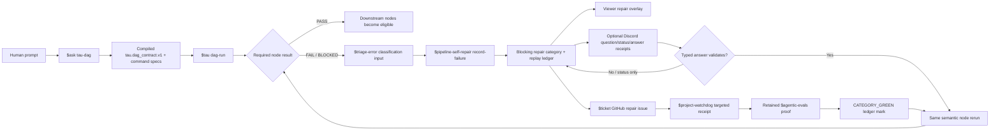

# Repairable DAG status board

This board exists so the repairable-DAG work is visible, reviewable, and bounded by evidence instead of hidden behind commit messages or local JSON files.

## Why this board exists

The repairable-DAG implementation must be collaborative and visual. The default reviewer should be able to answer four questions without reading source first:

1. Which runtime path was exercised?
2. Which proof artifact backs each claim?
3. Which parts are still simulated/local only?
4. What remains before this is a full product-ready loop?

## Current runtime shape



## Proof matrix

| Capability | Committed eval | Local proof report | Current readback | Proof boundary |
| --- | --- | --- | --- | --- |
| Default ledger trace | `evals/tau_ledger_trace_agentic_eval.json` | `local/agentic-evals/tau-ledger-trace-agentic-evals-report.json` | `READY`, `mocked=false`, `live=true`, `trials=2` | Live local Tau CLI and ledger verification; not provider quality or full browser UX. |
| Required-node failure repair overlay | `evals/tau_pipeline_self_repair_agentic_eval.json` | `local/agentic-evals/tau-pipeline-self-repair-agentic-evals-report.json` | `READY`, `mocked=false`, `live=true`, `trials=2` | Live local Tau CLI plus `$pipeline-self-repair` safe-mode record/inspect; no GitHub ticket publication or watchdog dispatch. |
| Discord typed unblock receipts and ops-discord handoff | `evals/tau_discord_unblock_agentic_eval.json` | `local/agentic-evals/tau-discord-unblock-agentic-evals-report.json` | `READY`, `mocked=false`, `live=true`, `trials=2` | Live local Tau CLI plus `$ops-discord notify --dry-run` receipt validation; no real Discord network delivery. |
| Discord live notification delivery | `scripts/agentic-eval-tau-discord-unblock.py --discord-bot --channel-name horus --live-notify` | `local/agentic-evals/tau-discord-live-delivery-proof.json` | `PASS`, `mocked=false`, `live=true`, `transport=discord_bot`, `status=SENT`, `discord_message_id=1542989185848311861` | Live Tau path invoked `$ops-discord notify --discord-bot` against the `horus` Discord channel and preserved the message URL. |
| Browser-visible repair overlay | `evals/tau_repair_overlay_browser_agentic_eval.json` | `local/agentic-evals/tau-repair-overlay-browser-agentic-evals-report.json` | `READY`, `mocked=false`, `live=true`, `trials=2` | Live local Tau viewer rendered in headless Chrome; browser requests were read-only `GET`; the run also posted live Discord bot messages to `horus`. |
| Same semantic node rerun after repair | `evals/tau_same_node_rerun_agentic_eval.json` | `local/agentic-evals/tau-same-node-rerun-agentic-evals-report.json` | `READY`, `mocked=false`, `live=true`, `trials=2`, `coder` attempt count `2` | Live local Tau CLI with safe command-spec fixtures; proves scheduler/ledger semantics, not provider semantic quality or real ticket closure. |
| ops-discord notification idempotency | `evals/tau_discord_idempotency_agentic_eval.json` | `local/agentic-evals/tau-discord-idempotency-agentic-evals-report.json` | `READY`, `mocked=false`, `live=true`, `trials=2`, notification `status=DEDUPED` | Direct Tau repair notification path with `/bin/false` as a no-send sentinel; proves duplicate category detection before external notification execution. |
| ops-discord failure visibility | `evals/tau_discord_failure_path_agentic_eval.json` | `local/agentic-evals/tau-discord-failure-path-agentic-evals-report.json` | `READY`, `mocked=false`, `live=true`, `trials=2`, notification `status=CHANNEL_NOT_FOUND` | Live Discord bot failure path with an intentionally missing channel; proves failure details are preserved, not that delivery succeeded. |
| Ticket/watchdog category-green lifecycle | `evals/tau_same_node_rerun_agentic_eval.json` plus live issue receipts | `local/agentic-evals/tau-ticket-watchdog-run/ticket-watchdog-category-green-artifact.json` | GitHub `grahama1970/tau#328` closed `COMPLETED`; ledger validation `PASS`; watchdog receipt `COMPLETED` / handled issue `328`; retained eval `READY`, `mocked=false`, `live=true`, `trials=2` | Live `$ticket` issue create/lease/close, live `$project-watchdog` targeted dry-run pickup, and live `$pipeline-self-repair` category closure. The watchdog proof did not run `--apply` because that path creates a repair worktree; the project rule forbids new worktrees in this session. |

Readback command used for the table:

```bash
python - <<'PY'
import json
for f in [
 'local/agentic-evals/tau-ledger-trace-agentic-evals-report.json',
 'local/agentic-evals/tau-pipeline-self-repair-agentic-evals-report.json',
 'local/agentic-evals/tau-discord-unblock-agentic-evals-report.json',
 'local/agentic-evals/tau-repair-overlay-browser-agentic-evals-report.json',
 'local/agentic-evals/tau-same-node-rerun-agentic-evals-report.json',
 'local/agentic-evals/tau-discord-idempotency-agentic-evals-report.json',
 'local/agentic-evals/tau-discord-failure-path-agentic-evals-report.json',
]:
    p=json.load(open(f))
    print(f"{f}: schema={p.get('schema')} readiness={p.get('readiness')} mocked={p.get('mocked')} live={p.get('live')} trials={p.get('trial_count')} cases={p.get('case_count')}")
PY
```

## What is implemented

- `ProjectDagContract` accepts a top-level `repair_policy` key.
- Required node failures in `src/tau_coding/project_dag.py` can call `$pipeline-self-repair record-failure`.
- Tau writes failed-step and repair projection artifacts under the DAG run directory.
- DAG receipts include `pipeline_self_repair` and `pipeline_self_repair_artifacts`.
- The DAG viewer projection maps repair state into `snapshot.corrections`, node-level `correction`, and `run_summary.repair`.
- The React overview renders a repair summary.
- `tau discord-receipt` creates and validates local typed receipts for questions, status messages, answers, and answer validation.
- `$pipeline-self-repair` projections that enter human-adjudication state through `repair_policy.discord.require_human_adjudication=true` or human/adjudication failure signals call `$ops-discord notify` and preserve the `ops_discord.notification_receipt.v1` path in the repair overlay.
- Tau writes an adjudication routing manifest for human-adjudication repair states and treats unknown adjudication categories as fail-closed.
- Same-receipt-dir reruns of a blocked project DAG are authorized only after `$pipeline-self-repair validate-ledger --require-agentic-eval --json` returns `PASS`; Tau archives the prior SQLite run store and offsets node attempt counts so the repaired semantic node resumes at attempt 2.
- The static viewer bundle renders `run_summary.repair` in the run overview; the browser proof reads `data-qid="dag:overview:repair"` and checks the blocking category, `ops-discord · SENT`, human-question state, Discord message URL, and read-only HTTP methods.
- `$pipeline-self-repair record-failure --apply-ticket` created GitHub issue `grahama1970/tau#328` for `tau/coder/tau-project-dag-missing-required-evidence/src-tau-coding-project-dag-py/v1`.
- `$project-watchdog tick --project tau --issue 328` produced a live targeted receipt that selected issue `328` as `ticket_repair` and showed the Tau `$ask tau-dag` dispatch plan.
- `$pipeline-self-repair mark-repaired` moved the category to `CATEGORY_GREEN` using the retained same-node rerun `$agentic-evals` report, and `$ticket close` closed `grahama1970/tau#328` with machine-checkable closure evidence.

## What is not yet proven

- The browser overlay proof uses a live local browser/server and live Discord bot delivery, but it does not prove provider semantic quality or human acceptance of the repair.
- `$project-watchdog` pickup is proven by targeted live dry-run receipt, not `--apply`, because apply would create a per-dispatch repair worktree and this project session is under a no-new-worktree rule.

## Next visual/collaborative acceptance gates

1. If the no-new-worktree rule is lifted for watchdog specifically, run one bounded `$project-watchdog --apply` repair dispatch and attach the retained Tau receipt.
2. Keep Tau-specific failure codes in `$triage-error` so `$pipeline-self-repair` category keys stay stable for common project-DAG failures.

## Non-claim

This board does not claim Tau has completed the full repairable-DAG product goal. It shows the current implemented slice and the proof boundary that still needs to become visual and collaborative.
