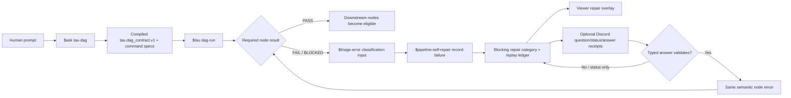

# Repairable DAG status board

This board exists so the repairable-DAG work is visible, reviewable, and bounded by evidence instead of hidden behind commit messages or local JSON files.

## Why this board exists

The repairable-DAG implementation must be collaborative and visual. The default reviewer should be able to answer four questions without reading source first:

1. Which runtime path was exercised?
2. Which proof artifact backs each claim?
3. Which parts are still simulated/local only?
4. What remains before this is a full product-ready loop?

## Current runtime shape



## Proof matrix

| Capability | Committed eval | Local proof report | Current readback | Proof boundary |
| --- | --- | --- | --- | --- |
| Default ledger trace | `evals/tau_ledger_trace_agentic_eval.json` | `local/agentic-evals/tau-ledger-trace-agentic-evals-report.json` | `READY`, `mocked=false`, `live=true`, `trials=2` | Live local Tau CLI and ledger verification; not provider quality or full browser UX. |
| Required-node failure repair overlay | `evals/tau_pipeline_self_repair_agentic_eval.json` | `local/agentic-evals/tau-pipeline-self-repair-agentic-evals-report.json` | `READY`, `mocked=false`, `live=true`, `trials=2` | Live local Tau CLI plus `$pipeline-self-repair` safe-mode record/inspect; no GitHub ticket publication or watchdog dispatch. |
| Discord typed unblock receipts and ops-discord handoff | `evals/tau_discord_unblock_agentic_eval.json` | `local/agentic-evals/tau-discord-unblock-agentic-evals-report.json` | `READY`, `mocked=false`, `live=true`, `trials=2` | Live local Tau CLI plus `$ops-discord notify --dry-run` receipt validation; no real Discord network delivery. |
| Discord live notification delivery | `scripts/agentic-eval-tau-discord-unblock.py --discord-bot --channel-name horus --live-notify` | `local/agentic-evals/tau-discord-live-delivery-proof.json` | `PASS`, `mocked=false`, `live=true`, `transport=discord_bot`, `status=SENT`, `discord_message_id=1542989185848311861` | Live Tau path invoked `$ops-discord notify --discord-bot` against the `horus` Discord channel and preserved the message URL. |

Readback command used for the table:

```bash
python - <<'PY'
import json
for f in [
 'local/agentic-evals/tau-ledger-trace-agentic-evals-report.json',
 'local/agentic-evals/tau-pipeline-self-repair-agentic-evals-report.json',
 'local/agentic-evals/tau-discord-unblock-agentic-evals-report.json',
]:
    p=json.load(open(f))
    print(f"{f}: schema={p.get('schema')} readiness={p.get('readiness')} mocked={p.get('mocked')} live={p.get('live')} trials={p.get('trial_count')} cases={p.get('case_count')}")
PY
```

## What is implemented

- `ProjectDagContract` accepts a top-level `repair_policy` key.
- Required node failures in `src/tau_coding/project_dag.py` can call `$pipeline-self-repair record-failure`.
- Tau writes failed-step and repair projection artifacts under the DAG run directory.
- DAG receipts include `pipeline_self_repair` and `pipeline_self_repair_artifacts`.
- The DAG viewer projection maps repair state into `snapshot.corrections`, node-level `correction`, and `run_summary.repair`.
- The React overview renders a repair summary.
- `tau discord-receipt` creates and validates local typed receipts for questions, status messages, answers, and answer validation.
- `$pipeline-self-repair` projections that enter human-adjudication state through `repair_policy.discord.require_human_adjudication=true` or human/adjudication failure signals call `$ops-discord notify` and preserve the `ops_discord.notification_receipt.v1` path in the repair overlay.

## What is not yet proven

- A successful Discord message permalink is proven for the live bot path. Remaining work is visual browser readback of the React Flow overlay and same-semantic-node rerun through downstream completion.
- Real `$ticket` GitHub issue creation/update/reopen binding is not proven in this slice.
- Real `$project-watchdog` dispatch from a repair category is not proven in this slice.
- Full repair closure is not proven: the current repair eval stops at a blocking `NEEDS_TRIAGE` category and validates that downstream nodes did not run.
- Browser-level visual proof of the React Flow overlay is not yet attached to this board.

## Next visual/collaborative acceptance gates

1. Add a viewer screenshot receipt for a DAG run that contains a repair overlay.
2. Add a safe `$ticket` boundary proof that binds a stable `category_key` to a GitHub issue without duplicating tickets.
3. Add a `$project-watchdog` dry-run/receipt proof showing it can pick up the repair category.
4. Add a real Discord notification/question proof or explicitly mark Discord network delivery out of scope until `$ops-discord` exposes a generic command.
5. Add a same-semantic-node rerun proof that starts from an open repair category, reruns the failed node, closes the blocker, and then allows downstream scheduling.

## Non-claim

This board does not claim Tau has completed the full repairable-DAG product goal. It shows the current implemented slice and the proof boundary that still needs to become visual and collaborative.
